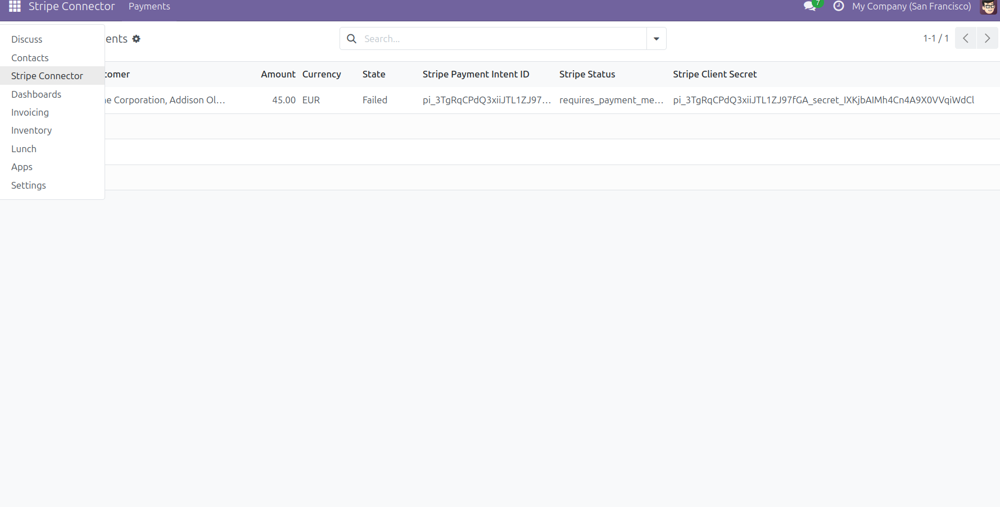
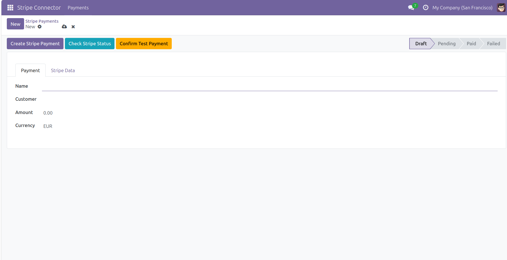
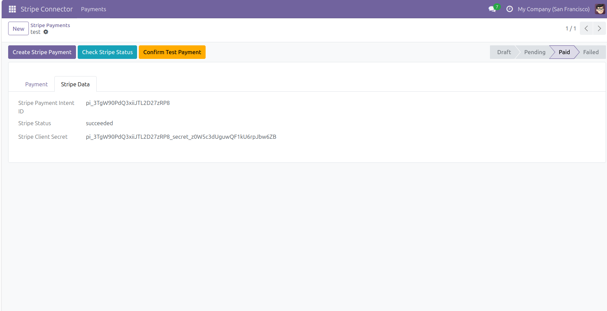

# Odoo 18 Stripe Payment Connector

A custom Odoo 18 module integrated with the Stripe API to create Payment Intents, check payment status, process webhook events, and automatically synchronize payment states inside Odoo.

## Features

* Create Stripe Payment Intents directly from Odoo
* Store Stripe Payment Intent ID
* Store Stripe Status
* Store Stripe Client Secret
* Check payment status from Stripe
* Confirm test payments using Stripe test payment methods
* Receive Stripe webhook events
* Automatically update Odoo payment status
* Docker-based deployment

## Supported Stripe Events

* payment_intent.succeeded
* payment_intent.payment_failed

## Tech Stack

* Odoo 18
* Python
* Stripe API
* PostgreSQL
* Docker

## Project Structure

```text
odoo-stripe-payment-connector/
├── Dockerfile
├── docker-compose.yml
├── README.md
├── .gitignore
└── payment_stripe_connector/
```

## Installation

### 1. Clone the repository

```bash
git clone https://github.com/YOUR_USERNAME/odoo-stripe-payment-connector.git
```

### 2. Create a Stripe Test Account

Create a free Stripe test account and obtain your Secret Key.

### 3. Create a .env file

```env
STRIPE_SECRET_KEY=your_stripe_test_secret_key
```

### 4. Start Docker

```bash
docker compose up --build
```

### 5. Install the module

* Open Odoo
* Update Apps List
* Install **Stripe Payment Connector**

## Demo Workflow

1. Open Stripe Connector → Payments
2. Click **New** to create a payment
3. Enter the payment information
4. Click **Create Stripe Payment**
5. Stripe creates a Payment Intent
6. Odoo stores the Stripe information
7. Click **Confirm Test Payment**
8. Stripe confirms the payment
9. The webhook automatically updates the payment status

## Payment States

| State   | Description              |
| ------- | ------------------------ |
| Draft   | Initial state            |
| Pending | Payment Intent created   |
| Paid    | Stripe payment succeeded |
| Failed  | Stripe payment failed    |

## Screenshots

### Menu



### New Payment



### Payment Status



### Stripe Data


## Video Demo

https://youtu.be/nhmPIfhPVlE

## Author

Jordi Prim
